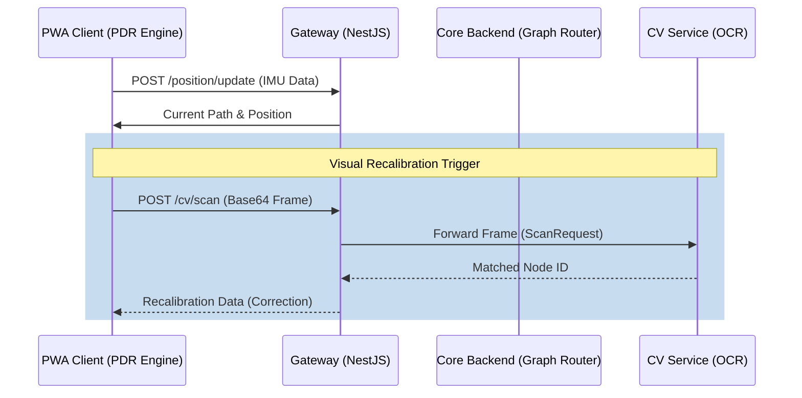

# NAV_AR Architectural Design Plan

## 1. 3D Graph Router (Core Backend)

### Logic Overview
- **Data Structure:** Use a directed graph (NetworkX) to represent the facility. Nodes have $(x, y, z)$ coordinates and floor levels.
- **Algorithm:** A* pathfinding with Euclidean distance as the heuristic.
- **Floor Weighting:** Apply a multiplier to vertical edges (stairs/elevators) to penalize floor changes.

### Interfaces (TypeScript/NestJS)
```typescript
interface GraphNode {
  id: string;
  x: number;
  y: number;
  floor: number;
  tag?: string; // e.g., "ROOM_101"
}

interface PathRequest {
  startNode: string;
  targetNode: string;
}

interface PathResponse {
  path: string[];
  totalDistance: number;
  nodesDetail: GraphNode[];
}
```

## 2. OCR Recalibration (CV Service)

### Logic Overview
- **Pipeline:** Pre-processing (Grayscale -> Denoise -> Threshold) -> EasyOCR Inference -> Fuzzy Matching.
- **Caching:** Cache EasyOCR `Reader` instance to avoid initialization overhead.
- **Fuzzy Matching:** Use Levenshtein distance to match OCR text against `KNOWN_SIGNAGE`.

### Data Structures (Python)
```python
from pydantic import BaseModel
from typing import Optional

class RecalibrateRequest(BaseModel):
    session_id: str
    image_base64: str
    estimated_position: dict # {x, y, floor}

class RecalibrateResponse(BaseModel):
    recalibrated: bool
    matched_node_id: Optional[str]
    confidence: float
```

## 3. PWA PDR Engine (Frontend)

### Logic Overview
- **Step Detection:** Peak detection on accelerometer magnitude with a dynamic threshold.
- **Orientation:** Convert `DeviceOrientationEvent.alpha` to map-relative radians.
- **Drift Correction:** Provide an interface to update $(x, y)$ coordinates upon receiving OCR recalibration data.

### Interfaces (TypeScript)
```typescript
interface PDRState {
  x: number;
  y: number;
  heading: number;
  stepCount: number;
}
```

## 4. Testing Strategy
- **Backend (Pytest):** Test A* with known simple graphs and multi-floor transitions.
- **CV (Pytest):** Mock OCR results to test fuzzy matching and regex filtering.
- **Frontend (Vitest/Jest):** Test step detection logic with synthetic accelerometer data.

## 5. Sequence Diagram


